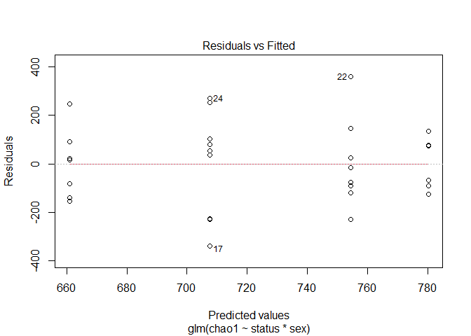

Analysis of data
================
Emilia König et al.
2022-12-15

# Data overview

The data has 4818 rows and 32 columns.

# Alpha diversity

## Shannon index

Shannon index values were calculated with the `vegan` package function
`diversity`.

<!-- -->

    ## 
    ## Call:
    ## glm(formula = shannon ~ status * sex, data = shannon_df)
    ## 
    ## Deviance Residuals: 
    ##      Min        1Q    Median        3Q       Max  
    ## -0.78488  -0.16823  -0.02033   0.20889   0.52717  
    ## 
    ## Coefficients:
    ##                         Estimate Std. Error t value Pr(>|t|)    
    ## (Intercept)              5.05563    0.11840  42.700   <2e-16 ***
    ## statusControl            0.21276    0.17428   1.221    0.233    
    ## sexbarrow               -0.07637    0.16212  -0.471    0.642    
    ## statusControl:sexbarrow -0.09472    0.23139  -0.409    0.686    
    ## ---
    ## Signif. codes:  0 '***' 0.001 '**' 0.01 '*' 0.05 '.' 0.1 ' ' 1
    ## 
    ## (Dispersion parameter for gaussian family taken to be 0.09812803)
    ## 
    ##     Null deviance: 2.8491  on 29  degrees of freedom
    ## Residual deviance: 2.5513  on 26  degrees of freedom
    ## AIC: 21.199
    ## 
    ## Number of Fisher Scoring iterations: 2

<!-- --><!-- --><!-- --><!-- -->

A general linear model was used for evaluating the effects of `status`
and `sex` on the calculated Shannon index values. The `status` was not a
statistically significant term in the model with a $p$-value of 0.23.

``` r
wilcox.test(shannon ~ status, data = shannon_df, conf.int = TRUE) 
```

    ## 
    ##  Wilcoxon rank sum exact test
    ## 
    ## data:  shannon by status
    ## W = 71, p-value = 0.08919
    ## alternative hypothesis: true location shift is not equal to 0
    ## 95 percent confidence interval:
    ##  -0.40597137  0.07079961
    ## sample estimates:
    ## difference in location 
    ##             -0.1960722

The nonparametric Mann-Whitney test is quite close to being
statistically significant at $\alpha$-value `0.05`.

### Log-transformed Shannon

    ## 
    ## Call:
    ## glm(formula = ln_shannon ~ status * sex, data = shannon_df)
    ## 
    ## Deviance Residuals: 
    ##       Min         1Q     Median         3Q        Max  
    ## -0.164265  -0.031560  -0.003407   0.042318   0.101363  
    ## 
    ## Coefficients:
    ##                         Estimate Std. Error t value Pr(>|t|)    
    ## (Intercept)              1.61867    0.02366  68.415   <2e-16 ***
    ## statusControl            0.04216    0.03483   1.210    0.237    
    ## sexbarrow               -0.01409    0.03240  -0.435    0.667    
    ## statusControl:sexbarrow -0.02097    0.04624  -0.454    0.654    
    ## ---
    ## Signif. codes:  0 '***' 0.001 '**' 0.01 '*' 0.05 '.' 0.1 ' ' 1
    ## 
    ## (Dispersion parameter for gaussian family taken to be 0.003918471)
    ## 
    ##     Null deviance: 0.11320  on 29  degrees of freedom
    ## Residual deviance: 0.10188  on 26  degrees of freedom
    ## AIC: -75.418
    ## 
    ## Number of Fisher Scoring iterations: 2

<!-- --><!-- --><!-- --><!-- -->

## Chao1 Index

Richness was evaluated by calculating the Chao1 index using the
`estimateR` function from the `vegan` package.

<!-- -->

    ## 
    ## Call:
    ## glm(formula = chao1 ~ status * sex, data = shannon_df)
    ## 
    ## Deviance Residuals: 
    ##     Min       1Q   Median       3Q      Max  
    ## -338.50  -112.73    18.98    88.59   359.73  
    ## 
    ## Coefficients:
    ##                         Estimate Std. Error t value Pr(>|t|)    
    ## (Intercept)               660.90      65.70  10.059 1.88e-10 ***
    ## statusControl             119.33      96.71   1.234    0.228    
    ## sexbarrow                  93.50      89.97   1.039    0.308    
    ## statusControl:sexbarrow  -166.10     128.41  -1.294    0.207    
    ## ---
    ## Signif. codes:  0 '***' 0.001 '**' 0.01 '*' 0.05 '.' 0.1 ' ' 1
    ## 
    ## (Dispersion parameter for gaussian family taken to be 30218.85)
    ## 
    ##     Null deviance: 842336  on 29  degrees of freedom
    ## Residual deviance: 785690  on 26  degrees of freedom
    ## AIC: 400.33
    ## 
    ## Number of Fisher Scoring iterations: 2

<!-- --><!-- --><!-- --><!-- -->

A general linear model was used for evaluating the effects of `status`
and `sex` on the calculated Chao1 index values. The `status` was not a
statistically significant term in the model with a $p$-value of 0.23.

``` r
wilcox.test(chao1 ~ status, data = shannon_df, conf.int = TRUE) 
```

    ## 
    ##  Wilcoxon rank sum exact test
    ## 
    ## data:  chao1 by status
    ## W = 91, p-value = 0.3892
    ## alternative hypothesis: true location shift is not equal to 0
    ## 95 percent confidence interval:
    ##  -180.94348   97.55556
    ## sample estimates:
    ## difference in location 
    ##                 -59.95

The nonparametric Mann-Whitney test is not statistically significant.

# Beta-diversity

<!-- --><!-- -->

## PERMANOVA

    ## Permutation test for adonis under reduced model
    ## Terms added sequentially (first to last)
    ## Permutation: free
    ## Number of permutations: 999
    ## 
    ## adonis2(formula = biom_dist ~ status, data = shannon_df)
    ##          Df SumOfSqs      R2      F Pr(>F)
    ## status    1   0.1693 0.03821 1.1124  0.266
    ## Residual 28   4.2614 0.96179              
    ## Total    29   4.4307 1.00000

The $p$-value for PERMANOVA between the groups was 0.27.

# Session Info

``` r
sessionInfo()
```

    ## R version 4.2.2 (2022-10-31 ucrt)
    ## Platform: x86_64-w64-mingw32/x64 (64-bit)
    ## Running under: Windows 10 x64 (build 22000)
    ## 
    ## Matrix products: default
    ## 
    ## locale:
    ## [1] LC_COLLATE=English_Finland.utf8  LC_CTYPE=English_Finland.utf8   
    ## [3] LC_MONETARY=English_Finland.utf8 LC_NUMERIC=C                    
    ## [5] LC_TIME=English_Finland.utf8    
    ## 
    ## attached base packages:
    ## [1] stats     graphics  grDevices utils     datasets  methods   base     
    ## 
    ## other attached packages:
    ##  [1] here_1.0.1        nlme_3.1-160      lme4_1.1-31       Matrix_1.5-1     
    ##  [5] viridis_0.6.2     viridisLite_0.4.1 glue_1.6.2        readxl_1.4.1     
    ##  [9] janitor_2.1.0     forcats_0.5.2     stringr_1.4.1     dplyr_1.0.10     
    ## [13] purrr_0.3.5       readr_2.1.3       tidyr_1.2.1       tibble_3.1.8     
    ## [17] ggplot2_3.4.0     tidyverse_1.3.2   vegan_2.6-4       lattice_0.20-45  
    ## [21] permute_0.9-7    
    ## 
    ## loaded via a namespace (and not attached):
    ##  [1] fs_1.5.2            lubridate_1.9.0     bit64_4.0.5        
    ##  [4] RColorBrewer_1.1-3  httr_1.4.4          rprojroot_2.0.3    
    ##  [7] tools_4.2.2         backports_1.4.1     utf8_1.2.2         
    ## [10] R6_2.5.1            DBI_1.1.3           mgcv_1.8-41        
    ## [13] colorspace_2.0-3    withr_2.5.0         tidyselect_1.2.0   
    ## [16] gridExtra_2.3       bit_4.0.4           compiler_4.2.2     
    ## [19] cli_3.4.1           rvest_1.0.3         xml2_1.3.3         
    ## [22] labeling_0.4.2      scales_1.2.1        digest_0.6.30      
    ## [25] minqa_1.2.5         rmarkdown_2.18      pkgconfig_2.0.3    
    ## [28] htmltools_0.5.3     highr_0.9           dbplyr_2.2.1       
    ## [31] fastmap_1.1.0       rlang_1.0.6         rstudioapi_0.14    
    ## [34] generics_0.1.3      farver_2.1.1        jsonlite_1.8.3     
    ## [37] vroom_1.6.0         googlesheets4_1.0.1 magrittr_2.0.3     
    ## [40] Rcpp_1.0.9          munsell_0.5.0       fansi_1.0.3        
    ## [43] lifecycle_1.0.3     stringi_1.7.8       yaml_2.3.6         
    ## [46] snakecase_0.11.0    MASS_7.3-58.1       grid_4.2.2         
    ## [49] parallel_4.2.2      crayon_1.5.2        haven_2.5.1        
    ## [52] splines_4.2.2       hms_1.1.2           knitr_1.40         
    ## [55] pillar_1.8.1        boot_1.3-28         reprex_2.0.2       
    ## [58] evaluate_0.18       modelr_0.1.10       vctrs_0.5.0        
    ## [61] nloptr_2.0.3        tzdb_0.3.0          cellranger_1.1.0   
    ## [64] gtable_0.3.1        assertthat_0.2.1    xfun_0.34          
    ## [67] broom_1.0.1         googledrive_2.0.0   gargle_1.2.1       
    ## [70] cluster_2.1.4       timechange_0.1.1    ellipsis_0.3.2
